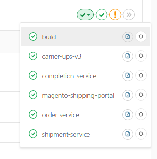
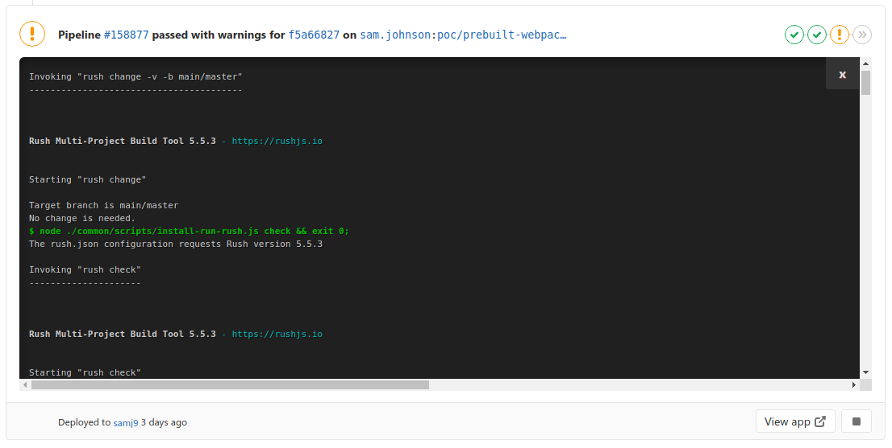
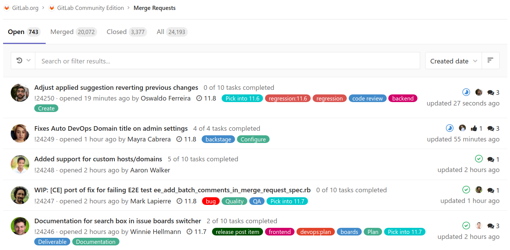

# Userscripts

> A repository dedicated to providing a good userscript development experience, and some scripts.

- [Userscripts](#userscripts)
  - [Scripts](#scripts)
    - [Gitlab Inline Pipelines](#gitlab-inline-pipelines)
    - [Gitlab MR list avatars](#gitlab-mr-list-avatars)
    - [Gitlab MR diff performance (WIP)](#gitlab-mr-diff-performance-wip)
  - [Contributing](#contributing)

## Scripts

Use [Tampermonkey](https://chrome.google.com/webstore/detail/tampermonkey/dhdgffkkebhmkfjojejmpbldmpobfkfo?hl=en) to installfrom the links below.

### Gitlab Inline Pipelines

:tv: [Install (gitlabPipelines.dist.user.js)](https://github.com/nfour/userscripts/raw/master/build/gitlabPipelines.dist.user.js)

Open a pipeline dropdown on an MR, then click the new button:

> 

See the job output:

> 

Notes:
- Clicking a different job's button will replace the current output
- The output will refresh every (default: 2 seconds), while the job is pending.

### Gitlab MR list avatars

:tv: [Install (gitlabMrList.dist.user.js)](https://github.com/nfour/userscripts/raw/master/build/gitlabMrList.dist.user.js)

Shows the MR authors avatar on any MR listing.

> 

### Gitlab MR diff performance (WIP)

Objective:
- On the MR diff section:
  - [ ] Do not show all files - show only the selected file from the sidebar tree
  - [ ] Do not collapse diffs

-------------------------------------------------------------------------------------------

## Contributing

- `yarn build --watch`
- Install `./build/<name>.dev.js` as a new userscript in Tampermonkey.

From then, the script will always reload whatever is at `./build/<name>.js`.
Refesh your browser to see changes after file save.
